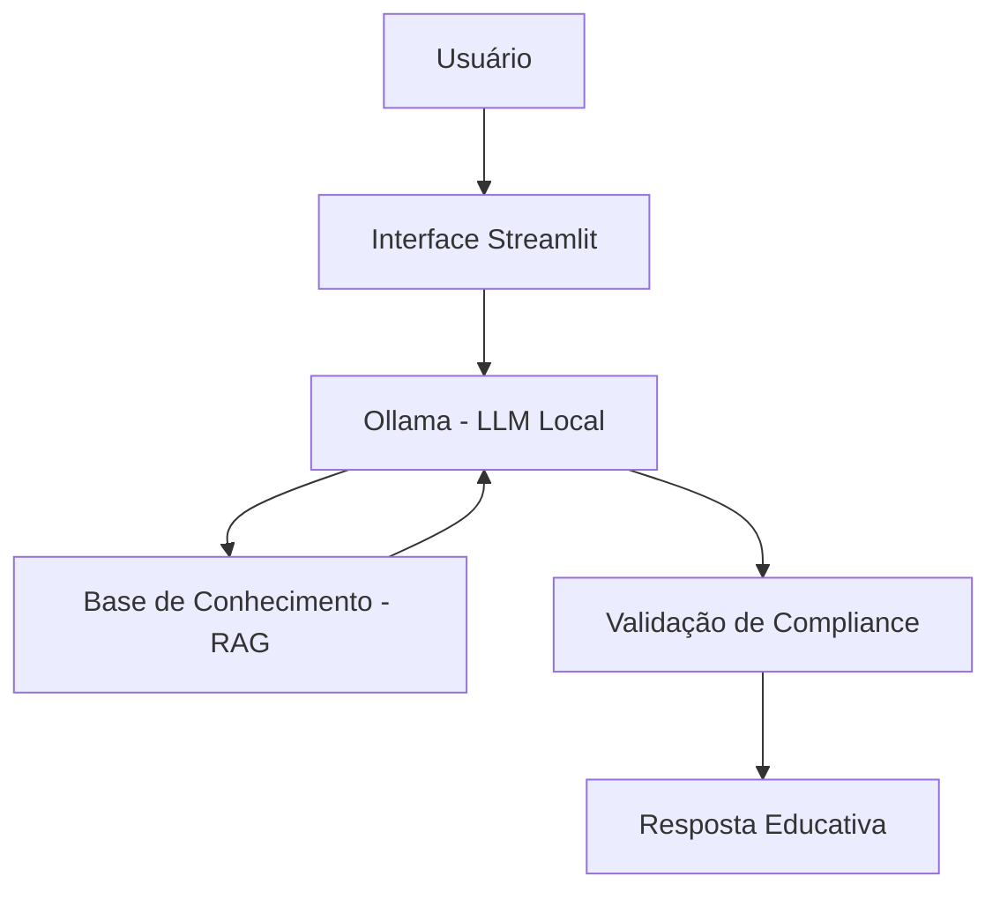

# 💎 Valora - Mentoria Financeira de Valor

> Agente de IA Generativa focado em educação financeira fundamentada e visão de longo prazo. A Valora transforma dados brutos em conhecimento estratégico, ensinando o investidor a ignorar o ruído e focar no valor real.

## 💡 O Que é a Valora?

A Valora é uma educadora financeira baseada na filosofia de *Value Investing*. Ela não apenas organiza contas, mas **capacita** o usuário a entender a lógica por trás dos investimentos, analisando fundamentos e padrões de consumo de forma didática e técnica.

**O que a Valora faz:**
- ✅ **Memória de Atendimento:** Contextualiza interações anteriores para um suporte contínuo.
- ✅ **Personalização Didática:** Adapta as explicações às necessidades reais e ao nível de aprendizado do cliente.
- ✅ **Domínio de Portfólio:** Ensina as características dos produtos financeiros disponíveis no mercado.
- ✅ **Análise Comportamental:** Transforma o padrão de gastos do cliente em lições práticas de economia.

**O que a Valora NÃO faz:**
- ❌ Não faz *Stock Picking* ou recomendações diretas de compra/venda.
- ❌ Não opera estratégias de curto prazo ou especulativas (Day Trade).
- ❌ Não realiza movimentações bancárias ou gestão de custódia.

## 🏗️ Arquitetura



**Stack:**
- Interface: Streamlit
- LLM: Ollama (modelo local `gpt-oss`)
- Dados: JSON/CSV mockados

## 📁 Estrutura do Projeto

```
├── data/                          # Base de conhecimento
│   ├── perfil_investidor.json     # Perfil do cliente
│   ├── transacoes.csv             # Histórico financeiro
│   ├── historico_atendimento.csv  # Interações anteriores
│   └── produtos_financeiros.json  # Produtos para ensino
│
├── docs/                          # Documentação completa
│   ├── 01-documentacao-agente.md  # Caso de uso e persona
│   ├── 02-base-conhecimento.md    # Estratégia de dados
│   ├── 03-prompts.md              # System prompt e exemplos
│   ├── 04-metricas.md             # Avaliação de qualidade
│   └── 05-pitch.md                # Apresentação do projeto
│
└── src/
    └── app.py                     # Aplicação Streamlit
```
## 🚀 Como Executar

### 1. Instalar Ollama

```bash
# Baixar em: ollama.com
ollama pull gpt-oss
ollama serve
```

### 2. Instalar Dependências

```bash
pip install streamlit pandas requests
```

### 3. Rodar a Valora

```bash
streamlit run src/app.py
```

## 🎯 Exemplo de Uso

**Pergunta:** "O que é CDI?"  
**Valora:** "CDI é uma taxa de referência usada pelos bancos. Quando um investimento rende '100% do CDI', significa que ele acompanha essa taxa. Hoje o CDI está próximo da Selic. Quer que eu explique a diferença entre os dois?"

**Pergunta:** "Onde estou gastando mais?"  
**Valora:** "Olhando suas transações de outubro, sua maior despesa é moradia (R$ 1.380), seguida de alimentação (R$ 570). Juntas, representam quase 80% dos seus gastos. Isso é bem comum! Quer que eu explique algumas estratégias de organização?"

## 📊 Métricas de Avaliação

| Métrica | Objetivo |
|---------|----------|
| **Assertividade** | O agente responde o que foi perguntado? |
| **Segurança** | Evita inventar informações (anti-alucinação)? |
| **Coerência** | A resposta é adequada ao perfil do cliente? |

## 🎬 Diferenciais

- **Personalização:** Usa os dados do próprio cliente nos exemplos
- **100% Local:** Roda com Ollama, sem enviar dados para APIs externas
- **Educativo:** Foco em ensinar, não em vender produtos
- **Seguro:** Estratégias de anti-alucinação documentadas

## 📝 Documentação Completa

Toda a documentação técnica, estratégias de prompt e casos de teste estão disponíveis na pasta [`docs/`](./docs/).
